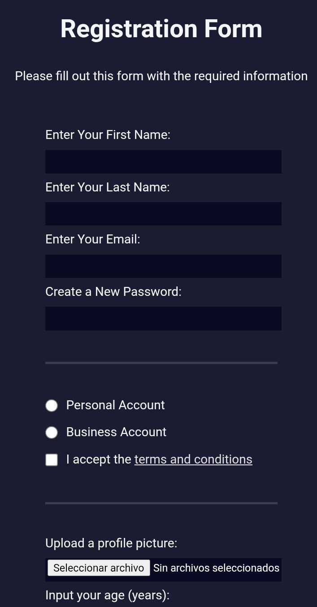

# 📝 Formulario de Registro - FCC


Este proyecto consiste en la creación de un **formulario de registro web** utilizando HTML y CSS.

Forma parte del curso **Responsive Web Design** de FreeCodeCamp y tiene como objetivo aprender a construir formularios accesibles y estructurados para recopilar información de usuarios.

---

## 🚀 Demo

[](https://carlosdm121.github.io/formulario-de-registroFCC/)

---

## 🖼 Vista del proyecto



---

## 🛠 Tecnologías utilizadas

<p>

</p>

- HTML5  
- CSS3  

---

## 📂 Características

✔ Formulario de registro completo  
✔ Validación básica de campos  
✔ Uso de distintos tipos de input  
✔ Diseño simple y claro  
✔ Proyecto ligero sin frameworks

---

## 📋 Campos del formulario

El formulario incluye diferentes elementos comunes en aplicaciones web:

- Nombre y apellido  
- Correo electrónico  
- Contraseña  
- Selección de tipo de cuenta  
- Casillas de verificación  
- Menú desplegable  
- Área de texto para comentarios  
- Botón de envío

Los formularios HTML permiten recopilar información del usuario mediante diferentes tipos de campos como texto, email, radio buttons o checkboxes. 2

---

## 📦 Instalación

1. Clonar el repositorio

```bash
git clone https://github.com/carlosdm121/formulario-de-registroFCC.git
```

2. Entrar al proyecto

```
cd formulario-de-registroFCC
```

3. Abrir el archivo

```
index.html
```

---

## 📚 Aprendizajes del proyecto

Este proyecto permite practicar:

- Creación de formularios HTML
- Uso de labels e inputs
- Validación básica de datos
- Diseño visual con CSS
- Estructura semántica de formularios

---

## 👨‍💻 Autor

Desarrollado por **Carlos Daniel Martínez**

🔗 GitHub  
https://github.com/carlosdm121
